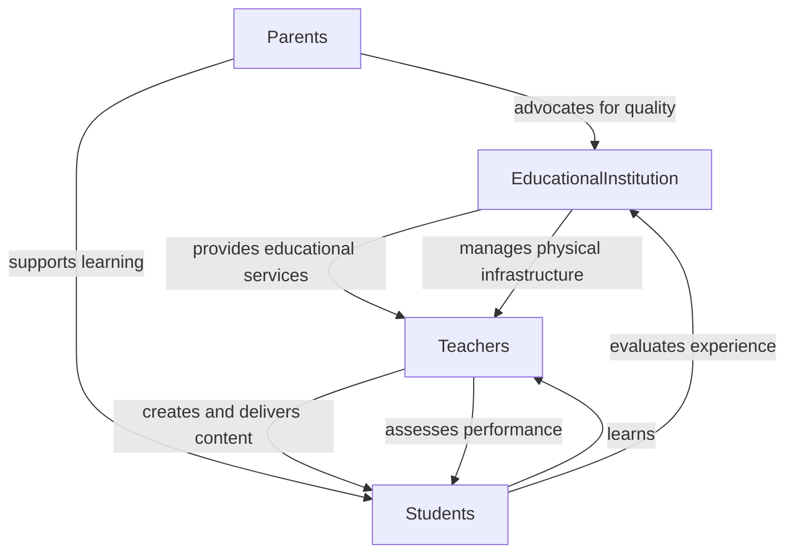
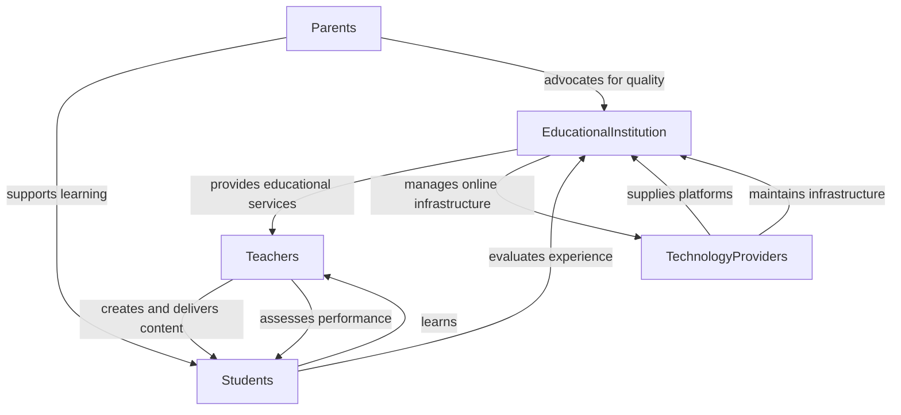
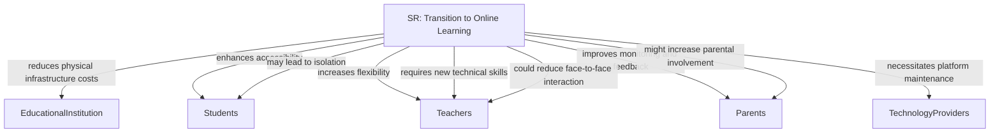

---
categories:
  - Course Work
created: 2024-10-30T20:09:17+08:00
modified: 2024-11-20T17:45:29+08:00
tags:
  - AIGC
  - PhD_Course/Software_Requirements_Engineering
title: 10月30日课堂作业：i* 模型建模
---

> [!WARNING]
> **This content was generated by AI.**
> AI can make mistakes. Check important info.

### iStar Modeling: Transition from Traditional Classroom Learning to Online Learning

#### Context

The transition from traditional classroom learning to online learning involves significant changes in the educational system. This scenario involves multiple actors with different roles and strategic interests. The goal is to model the strategic dependencies (SD) and strategic rationale (SR) before and after the transition, highlighting the reasoning behind the change.

#### Actors and Roles

1. **Educational Institution (EI)**
   - **Role 1:** Provider of educational services
   - **Role 2:** Manager of physical infrastructure
2. **Teachers (T)**
   - **Role 1:** Content creators and instructors
   - **Role 2:** Assessors of student performance
3. **Students (S)**
   - **Role 1:** Learners
   - **Role 2:** Evaluators of educational experience
4. **Parents (P)**
   - **Role 1:** Supporters of student learning
   - **Role 2:** Advocates for educational quality
5. **Technology Providers (TP)**
   - **Role 1:** Suppliers of online learning platforms
   - **Role 2:** Maintainers of technical infrastructure

#### Strategic Dependency (SD) Models

##### SD Model: As-Is (Traditional Classroom Learning)

##### SD Model: To-Be (Online Learning)

#### Strategic Rationale (SR) Model

#### Explanation of the SR Model

- **Educational Institution:** The transition to online learning reduces the need for physical infrastructure, thereby lowering costs. However, it requires investment in online platforms and technical support.
- **Students:** Online learning enhances accessibility, allowing students to learn from anywhere. However, it may lead to feelings of isolation if not managed properly.
- **Teachers:** Teachers gain flexibility in delivering content but need to acquire new technical skills. The reduced face-to-face interaction could affect the quality of teaching.
- **Parents:** Parents can monitor their children's progress more closely, potentially increasing their involvement. However, they may also need to provide more support at home.
- **Technology Providers:** They play a crucial role in maintaining the online infrastructure and ensuring the smooth operation of the learning platforms.

This iStar model illustrates the strategic dependencies and rationale behind the transition from traditional classroom learning to online learning, highlighting the changes in roles, interests, and operational processes.
