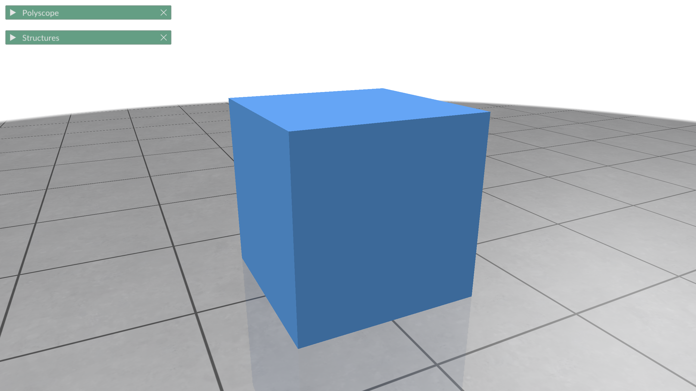

## 问题

请编写带有图形界面的普通三阶魔方模拟程序.

要求:

- 实现平移、放大、缩小和自适应大小的魔方展示功能.
- 请自定义编码表示魔方的各种可能操作, 每种编码表示其中 1 种操作.
- 实现打开文本文件的功能, 该文本文件由一系列编码组成, 对应魔方操作.
- 实现魔方操作功能: 可以交互实现每个操作, 也可以通过动画自动播放魔方的系列操作.
- 在操作或转动魔方时, 必须以动画的形式展示, 从而方便看清如何操作或转动.
- 可以保存魔方操作, 保存结果是由一系列编码组成文本文件.
- 编写文档详细介绍模拟算法与图形界面等内容.

参考:

- 雍俊海. 清华教授的小课堂魔方真好玩. 北京: 清华大学出版社.

## 项目结构

```
 .
├──  src
│   ├──  creation
│   │   ├──  cube.cc
│   │   └──  cube.h
│   └──  main.cc
└──  xmake.lua
```

## 构建配置文件: `xmake.lua`

```lua
add_rules("mode.debug", "mode.release")

add_requires("eigen ~3.4.0") -- 线性代数库
add_requires("polyscope ~2.3") -- 可视化框架

target("tiny-cubik")
  set_kind("binary")
  set_languages("c++20") -- 使用现代C++特性
  set_toolchains("clang") -- 指定编译器

  add_headerfiles("src/**.h")
  add_files("src/**.cc")

  add_packages("eigen") -- 依赖管理
  add_packages("polyscope") -- 依赖管理
```

## 主程序

### `creation/cube.cc`

```cpp
#include "cube.h"

auto make_cube(Eigen::Vector3d center)
    -> std::tuple<Eigen::MatrixX3d, Eigen::MatrixX4i> {
  Eigen::MatrixX3d points(8, 3);
  points << 0, 0, 0,  //
      1, 0, 0,        //
      1, 1, 0,        //
      0, 1, 0,        //
      0, 0, 1,        //
      1, 0, 1,        //
      1, 1, 1,        //
      0, 1, 1;
  points.rowwise() += center.transpose();
  Eigen::MatrixX4i triangles(6, 4);
  triangles << 0, 1, 2, 3,  //
      4, 5, 6, 7,           //
      0, 1, 5, 4,           //
      1, 2, 6, 5,           //
      2, 3, 7, 6,           //
      3, 0, 4, 7;
  return {points, triangles};
}
```

### `main.cc`

```cpp
#include <polyscope/polyscope.h>
#include <polyscope/surface_mesh.h>

#include <Eigen/Dense>

#include "creation/cube.h"

auto main(int argc, char** argv) -> int {
  polyscope::init();
  auto [points, triangles] = make_cube();
  polyscope::registerSurfaceMesh("cube", points, triangles);
  polyscope::show();
  return 0;
}
```

## 配置, 编译, 运行

```console
$ xmake config # 配置
$ xmake        # 编译
$ xmake run    # 运行
```


